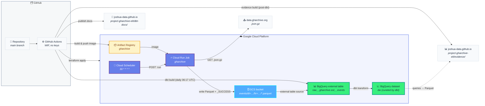

# project-gharchive-elt

**What this is:** an hourly **ELT pipeline** that ingests [GitHub Archive](https://www.gharchive.org/) events into Google Cloud, plus a **dbt transformation layer** that builds curated facts and dimensions on top. Raw events land as Hive-partitioned Parquet in GCS (exposed via a BigQuery external table); dbt builds curated models into a separate `dw` dataset daily.

**How it runs:**
- **Ingest (hourly):** a Python container executes as a **Cloud Run Job**, triggered every hour by **Cloud Scheduler**. Built and deployed by GitHub Actions on every push to `main`.
- **Transform (daily):** GitHub Actions schedule (`17 6 * * *` UTC) runs `dbt build` against BigQuery. On every push to `main` that touches `dbt/**`, the same workflow regenerates dbt docs and publishes them to the [`joshua-data.github.io`](https://github.com/joshua-data/joshua-data.github.io) repo.
- **Visualize (daily):** a second GitHub Actions workflow (`evidence-build`, chained to `dbt-run` via `workflow_run`, plus push on `evidence/**` and manual `workflow_dispatch`) builds an [Evidence.dev](https://evidence.dev) static BI site from the curated marts and publishes it alongside dbt docs on GitHub Pages.

**How it's managed:** all GCP infrastructure (bucket, datasets, table, Cloud Run Job, scheduler, service accounts, IAM, WIF) lives in one Terraform root module under `terraform/`. All four workflows (terraform, ingest-deploy, dbt-run, evidence-build) authenticate via **Workload Identity Federation** — no service-account keys exist anywhere in the repo or in GitHub.

**Where to start:** pipeline code → [`ingest/`](ingest/README.md). Transformation models → [`dbt/`](dbt/README.md). Evidence site → [`evidence/`](evidence/README.md). Infrastructure → [`terraform/`](terraform/README.md). Hosted dbt docs → <https://joshua-data.github.io/project-gharchive-elt/dbt-docs/>. Hosted Evidence site → <https://joshua-data.github.io/project-gharchive-elt/evidence/>.

## Architecture

## End-to-end flow

1. **Cloud Scheduler** fires at `30 * * * *` UTC and POSTs to the Cloud Run Job admin API, authenticating as the `gharchive-invoker` service account.
2. **Cloud Run Job** starts the container as `gharchive-runner`. The job resolves which hours to process from `LAG_HOURS` / `CATCHUP_HOURS` (defaulting to "the hour that finished `LAG_HOURS` ago, plus the previous `CATCHUP_HOURS` for gap recovery").
3. For each target hour, the container checks for a `_SUCCESS` marker in GCS and skips if present (idempotent re-runs).
4. Otherwise it downloads `https://data.gharchive.org/{YYYY-MM-DD-H}.json.gz` with a retry loop (404/5xx/network → retry up to 5×, backoff capped at 60s).
5. JSON-Lines are streamed into a stable Parquet schema (Snappy-compressed) and uploaded to `gs://{project}-gharchive/events/dt=YYYY-MM-DD/hr=HH/YYYY-MM-DD-HH.parquet`, followed by an empty `_SUCCESS` sibling.
6. The **BigQuery external table** (`raw__gharchive.ext__events`) is configured with Hive partitioning AUTO, so new partitions become queryable immediately — no metadata refresh needed.
7. **dbt** (`dbt-run.yml`, daily `17 6 * * *` UTC) impersonates `gharchive-dbt-runner` via WIF, runs `dbt build --target prod --vars '{batch_date: <yesterday UTC>}'` against BigQuery, materializing curated facts and dimensions into `dw`. On every push to `main` that touches `dbt/**`, the same workflow also regenerates docs and publishes them to `joshua-data.github.io/project-gharchive-elt/dbt-docs/`.
8. **Evidence** (`evidence-build.yml`, chained to `dbt-run` via `workflow_run`) impersonates the same `gharchive-dbt-runner` SA. `npm run sources` materializes each `sources/bigquery/*.sql` against the fresh `dw` marts into local Parquet, `npm run build` compiles the SvelteKit site (DuckDB-WASM reads the Parquet in the browser — no live warehouse call), and the build is pushed to `joshua-data.github.io/project-gharchive-elt/evidence/`. Also fires on push to `main` under `evidence/**` and on manual `workflow_dispatch`.

## Tech stack

- **Runtime:** Python 3.12 (`httpx`, `pyarrow`, `pydantic-settings`, `google-cloud-storage`)
- **Container:** Docker, base `python:3.12-slim`, non-root user
- **Orchestration:** Cloud Run Job + Cloud Scheduler (ingest); GitHub Actions schedule (dbt)
- **Storage:** GCS (raw Parquet) → BigQuery external table (`raw__gharchive.ext__events`) → BigQuery curated (`dw`)
- **Transformation:** dbt-core / dbt-bigquery `1.11`, OAuth (ADC + WIF impersonation)
- **IaC:** Terraform `>= 1.6`, Google provider `~> 5.40`, state in GCS
- **CI/CD:** GitHub Actions with Workload Identity Federation (no SA keys)
- **Quality:** `ruff` for Python lint, `terraform fmt -check` + `validate` on every PR

## Getting started

There's no shortcut: the infra has to exist before the ingest job can run, and ingest needs to produce data before dbt has anything to transform. Do them in order:

1. **Provision infra** → [`terraform/README.md`](terraform/README.md) (bootstrap state bucket, `terraform apply`, copy outputs to GitHub secrets including the new `DBT_RUNNER_SA_EMAIL`).
2. **Deploy ingest** → push to `main`; `ingest-deploy.yml` builds the image and points the Cloud Run Job at it. Wait for at least one hourly run to land Parquet in GCS.
3. **Develop or backfill locally** → [`ingest/README.md`](ingest/README.md) (Python venv + ADC, or the `scripts/backfill.sh` Docker wrapper).
4. **Write dbt models** → [`dbt/README.md`](dbt/README.md) (local: `gcloud auth application-default login` + `dbt build --target dev`). Add the `DBT_DOCS_DEPLOY_TOKEN` secret (PAT for `joshua-data.github.io`) before the scheduled `dbt-run.yml` can publish docs.
5. **Author Evidence pages** → [`evidence/README.md`](evidence/README.md) (local: same ADC as dbt, `npm install && npm run dev`). Evidence deploy reuses the `DBT_DOCS_DEPLOY_TOKEN` secret added in step 4 — no extra secret needed. The first auto-deploy happens after the next successful `dbt-run` on `main` (via `workflow_run` chain).
