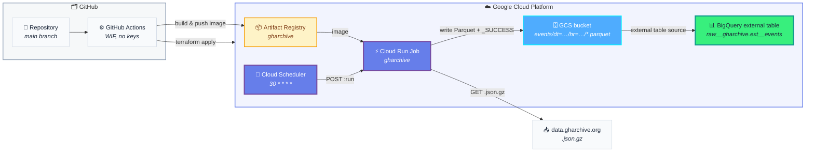

# project-gharchive-elt

Hourly ELT pipeline that ingests [GitHub Archive](https://www.gharchive.org/) events into Google Cloud, lands them as Hive-partitioned Parquet in GCS, and exposes them through a BigQuery external table. The job runs as a Cloud Run Job triggered by Cloud Scheduler. All GCP infrastructure is managed by Terraform, and CI/CD runs in GitHub Actions using Workload Identity Federation — there are no service-account keys in the repo.

## Architecture

## Repository layout

| Path | What's there |
|---|---|
| [`ingest/`](ingest/README.md) | Python 3.12 container — downloads the hourly `.json.gz` from gharchive.org, transforms to a stable schema, writes Parquet to GCS. **Start here if you're touching pipeline code.** |
| [`terraform/`](terraform/README.md) | All GCP infrastructure as code — bucket, BigQuery dataset/external table, Cloud Run Job, Scheduler, IAM, WIF. **Start here if you're touching infra.** |
| `.github/workflows/` | CI/CD — `ingest-deploy.yml` builds/pushes the image and updates the Cloud Run Job; `terraform.yml` plans on PRs and applies on `main`. |

## End-to-end flow

1. **Cloud Scheduler** fires at `30 * * * *` UTC and POSTs to the Cloud Run Job admin API, authenticating as the `gharchive-invoker` service account.
2. **Cloud Run Job** starts the container as `gharchive-runner`. The job resolves which hours to process from `LAG_HOURS` / `CATCHUP_HOURS` (defaulting to "the hour that finished `LAG_HOURS` ago, plus the previous `CATCHUP_HOURS` for gap recovery").
3. For each target hour, the container checks for a `_SUCCESS` marker in GCS and skips if present (idempotent re-runs).
4. Otherwise it downloads `https://data.gharchive.org/{YYYY-MM-DD-H}.json.gz` with a retry loop (404/5xx/network → retry up to 5×, backoff capped at 60s).
5. JSON-Lines are streamed into a stable Parquet schema (Snappy-compressed) and uploaded to `gs://{project}-gharchive/events/dt=YYYY-MM-DD/hr=HH/YYYY-MM-DD-HH.parquet`, followed by an empty `_SUCCESS` sibling.
6. The **BigQuery external table** (`raw__gharchive.ext__events`) is configured with Hive partitioning AUTO, so new partitions become queryable immediately — no metadata refresh needed.

## Tech stack

- **Runtime:** Python 3.12 (`httpx`, `pyarrow`, `pydantic-settings`, `google-cloud-storage`)
- **Container:** Docker, base `python:3.12-slim`, non-root user
- **Orchestration:** Cloud Run Job + Cloud Scheduler
- **Storage:** GCS (raw Parquet) → BigQuery external table
- **IaC:** Terraform `>= 1.6`, Google provider `~> 5.40`, state in GCS
- **CI/CD:** GitHub Actions with Workload Identity Federation (no SA keys)
- **Quality:** `ruff` for Python lint, `terraform fmt -check` + `validate` on every PR

## Getting started

There's no shortcut: the infra has to exist before the ingest job can run. Do them in order:

1. **Provision infra** → [`terraform/README.md`](terraform/README.md) (bootstrap state bucket, `terraform apply`, copy outputs to GitHub secrets).
2. **Deploy ingest** → push to `main`; `ingest-deploy.yml` builds the image and points the Cloud Run Job at it.
3. **Develop or backfill locally** → [`ingest/README.md`](ingest/README.md) (Python venv + ADC, or the `scripts/backfill.sh` Docker wrapper).
