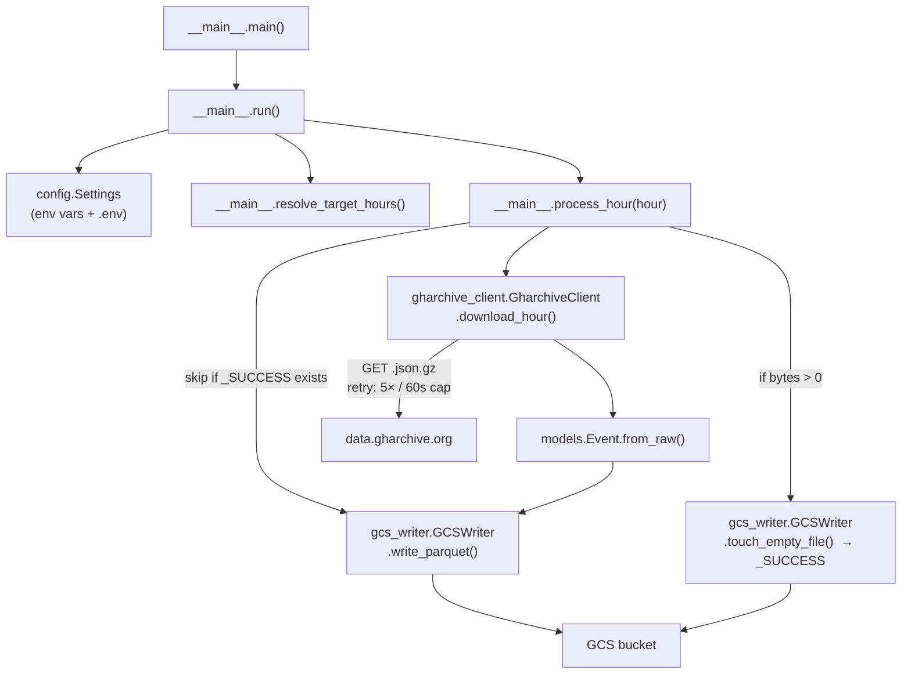

# ingest

Python service that powers the hourly ELT. Packaged as a Docker container and executed as a Cloud Run Job (see [`terraform/`](../terraform/README.md)). For each target hour it downloads `https://data.gharchive.org/{YYYY-MM-DD-H}.json.gz`, transforms each event into a stable Parquet schema, and writes a single Hive-partitioned file to GCS plus an empty `_SUCCESS` marker.

> ↩ Back to [project overview](../README.md).

## Internal call graph



## Package layout

| File | Responsibility |
|---|---|
| `src/gharchive/__main__.py` | Entry point. Loads settings, resolves target hours, orchestrates per-hour processing, decides exit code. |
| `src/gharchive/config.py` | `Settings` (Pydantic `BaseSettings`) — reads env vars / `.env`, holds defaults for URL & HTTP timeout. |
| `src/gharchive/gharchive_client.py` | `GharchiveClient` — HTTP fetch + gzip decode + JSON-Lines iterator, with a retry loop for 404/5xx/network. |
| `src/gharchive/models.py` | `Event` dataclass (`slots=True`) — the canonical record, including `hour` / `ingested_at` lineage fields. |
| `src/gharchive/gcs_writer.py` | `GCSWriter` + `PARQUET_SCHEMA` + path helpers. Serializes records to Parquet (Snappy) and uploads. |

## How a run picks which hours to process

`resolve_target_hours()` (in `__main__.py`) checks three modes in priority order:

| Priority | Trigger | Result |
|---|---|---|
| 1 | `TARGET_START_HOUR` **and** `TARGET_END_HOUR` set | Inclusive range `[start..end]` — used by backfills. |
| 2 | `TARGET_HOUR` set | Single hour — used by one-off reruns. |
| 3 | (default — auto mode) | `end = now_utc - LAG_HOURS`, `start = end - CATCHUP_HOURS`. The scheduled job runs in this mode. |

**Why `CATCHUP_HOURS` exists.** Re-processing the last few hours every run is essentially free because each hour with a `_SUCCESS` marker is skipped without downloading. If a single hour failed (gharchive late, transient 5xx, network blip), the next scheduled invocation just picks it up — no on-call paging, no manual backfill. We rely on this instead of Cloud Scheduler retries (see *Retries & timeouts*).

## GCS layout & Parquet schema

```
gs://{GCS_RAW_BUCKET}/
  events/
    dt=YYYY-MM-DD/
      hr=HH/
        YYYY-MM-DD-HH.parquet
        _SUCCESS
```

The Hive-style `dt=` / `hr=` prefixes are what makes the BigQuery external table partitioning work (`partitioning_mode = "AUTO"` in [`terraform/bigquery.tf`](../terraform/bigquery.tf)).

The Parquet schema (defined in `gcs_writer.PARQUET_SCHEMA`) is intentionally narrow:

| Field | Type | Nullable | Source |
|---|---|---|---|
| `id` | `int64` | no | event |
| `type` | `string` | no | event |
| `actor` | `string` (JSON-encoded) | no | event |
| `repo` | `string` (JSON-encoded) | no | event |
| `payload` | `string` (JSON-encoded) | no | event |
| `public` | `bool` | no | event |
| `created_at` | `string` (ISO-8601) | no | event |
| `org` | `string` (JSON-encoded) | yes | event |
| `hour` | `string` (`YYYY-MM-DD-H`) | no | lineage |
| `ingested_at` | `string` (ISO-8601) | no | lineage |

> **Why nested fields are JSON strings.** GitHub's event payloads are polymorphic and evolve: `PushEvent.payload` and `PullRequestEvent.payload` share almost nothing, and new event types appear over time. Forcing them into a single Parquet struct schema would either lose fields or break on drift. Storing them as JSON strings keeps the Parquet contract stable forever; downstream BigQuery queries unpack with `JSON_VALUE` / `JSON_QUERY` per event type. The two top-level lineage fields (`hour`, `ingested_at`) make it trivial to debug "which run wrote this row?".

## Idempotency contract

For each hour:

1. If `_SUCCESS` exists at the target path → skip (no download, no write).
2. Else download + write Parquet.
3. If the Parquet write produced **> 0 bytes** → touch `_SUCCESS`.
4. If the hour was **empty** (gharchive hasn't published it yet, or genuinely no events) → do **not** touch `_SUCCESS`. The next run will retry.

This is why partial / interrupted runs are safe: Parquet always lands before the marker, and the marker is the only thing that gates re-execution.

## Environment variables

Read by `config.Settings` (`config.py`); the Cloud Run Job sets the runtime ones from Terraform.

| Var | Default | Set where | Purpose |
|---|---|---|---|
| `GCS_RAW_BUCKET` | *(required)* | Terraform: `cloud_run_job.tf` | Target bucket name. |
| `LAG_HOURS` | `1` | Terraform var | Process the hour finished this many hours ago. gharchive publishes ~1h behind UTC. |
| `CATCHUP_HOURS` | `0` | Terraform var | Also re-attempt the previous N hours — free gap recovery thanks to `_SUCCESS`. |
| `TARGET_HOUR` | *(empty)* | local / backfill | Single hour, format `YYYY-MM-DD-H`. Overrides auto mode. |
| `TARGET_START_HOUR` | *(empty)* | local / backfill | Range start (inclusive). Overrides everything else if paired with end. |
| `TARGET_END_HOUR` | *(empty)* | local / backfill | Range end (inclusive). |
| `GHARCHIVE_BASE_URL` | `https://data.gharchive.org` | (rarely) | Useful for tests / mocks. |
| `HTTP_TIMEOUT` | `120.0` | (rarely) | Per-request timeout in seconds. |

`.env` is supported for local runs (see `.env.example`). The Cloud Run Job ignores `.env` and reads from container env directly.

## Retries & timeouts

`GharchiveClient._fetch_with_retry`:

- **5 attempts** total.
- Backoff = `min(retry_backoff * attempt, 60.0)` seconds.
- **Retryable:** HTTP 404 (file not yet published), HTTP 5xx, network errors, timeouts.
- **Not retryable:** other HTTP errors (4xx other than 404) — fail fast.

Because the app already retries aggressively per hour, **Cloud Scheduler is configured with `retry_count = 0`** ([`terraform/cloud_scheduler.tf`](../terraform/cloud_scheduler.tf)) and **Cloud Run Job with `max_retries = 1`** — adding scheduler-level retries would just risk a second invocation racing the first. Genuine failures are absorbed by `CATCHUP_HOURS` on the next scheduled run.

## Run it locally

### Option A — Python venv (fastest dev loop)

```bash
cd ingest
python -m venv .venv && source .venv/bin/activate
pip install -e .

cp .env.example .env
# edit .env: set GCS_RAW_BUCKET, optionally TARGET_HOUR

gcloud auth application-default login   # one-time
python -m gharchive
```

Logs go to stdout in the same format Cloud Run will see (`%(asctime)s %(levelname)s %(name)s %(message)s`).

### Option B — Docker, via `scripts/backfill.sh`

Use this when you want to backfill against the production bucket without modifying the Cloud Run Job. The script builds the image locally and runs the container with your ADC mounted in.

```bash
# Single hour
GCS_RAW_BUCKET=my-project-gharchive \
TARGET_HOUR=2025-05-29-12 \
./scripts/backfill.sh

# Date range
GCS_RAW_BUCKET=my-project-gharchive \
TARGET_START_HOUR=2025-05-29-00 \
TARGET_END_HOUR=2025-05-29-23 \
./scripts/backfill.sh
```

Prerequisite: `gcloud auth application-default login` once, so `~/.config/gcloud/application_default_credentials.json` exists.

## Container contract (for DevOps)

What Cloud Run Job sees:

- **Base image:** `python:3.12-slim`
- **Runs as:** non-root `app` user (UID created in the Dockerfile)
- **Entrypoint:** `python -m gharchive`
- **Stdout/stderr:** unbuffered (`PYTHONUNBUFFERED=1`) — picked up by Cloud Logging as-is
- **Exit code:** `0` iff every target hour ended `ok` or `skipped`; `1` if any hour failed or was empty. Cloud Run Job treats non-zero as a failed task.
- **Env vars consumed:** see *Environment variables* above. The Job sets `GCS_RAW_BUCKET`, `LAG_HOURS`, `CATCHUP_HOURS`.
- **Network egress:** only `data.gharchive.org` (HTTPS) and Google APIs (storage).

The image is built and pushed by `.github/workflows/ingest-deploy.yml` on every push to `main` that touches `ingest/**`, tagged with the commit SHA, then `gcloud run jobs update --image=...` points the existing Job at the new tag. The Terraform `google_cloud_run_v2_job` has `lifecycle.ignore_changes = [containers[0].image]` so CI and IaC don't fight over the image tag.

## Linting

```bash
ruff check ingest/        # or: ruff check --fix ingest/
```

Config in `pyproject.toml` — line length 100, target `py312`, rules `E,F,W,I,B,UP,SIM`.
