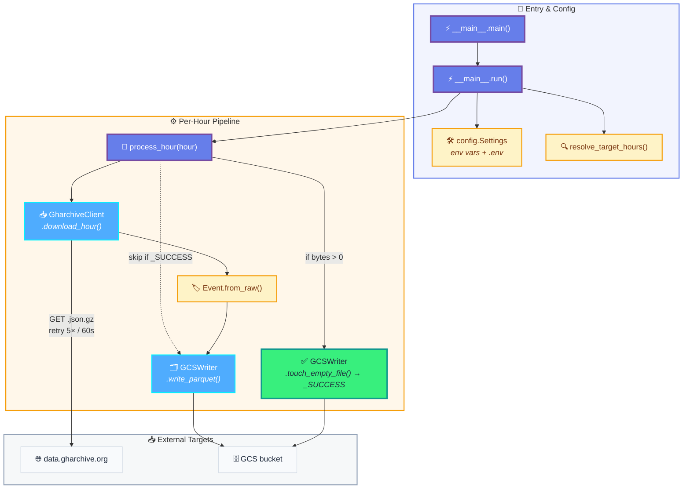

# ingest

**What this is:** the workload that runs *inside* the hourly Cloud Run Job. Everything else in this repo (Terraform, GitHub Actions) exists to ship and schedule this one Python container.

**What it does, per scheduled run:** resolves which UTC hour(s) to process, downloads `https://data.gharchive.org/{YYYY-MM-DD-H}.json.gz` for each, normalizes events into a stable Parquet schema, and lands them as a single Hive-partitioned file in GCS alongside an empty `_SUCCESS` marker. Idempotent: a run that finds `_SUCCESS` already in place is a no-op.

**Where to start reading code:** `src/gharchive/__main__.py` — `main()` → `run()` → `resolve_target_hours()` → `process_hour()` is the whole pipeline.

> ↩ Back to [project overview](../README.md).

## Internal call graph



## Package layout

| File | Responsibility |
|---|---|
| `src/gharchive/__main__.py` | Entry point. Loads settings, resolves target hours, orchestrates per-hour processing, decides exit code. |
| `src/gharchive/config.py` | `Settings` (Pydantic `BaseSettings`) — reads env vars / `.env`, holds defaults for URL & HTTP timeout. |
| `src/gharchive/gharchive_client.py` | `GharchiveClient` — streams the `.json.gz` to a temp file, then decodes it into a JSON-Lines iterator, with a retry loop for 404/5xx/network. |
| `src/gharchive/models.py` | `Event` dataclass (`slots=True`) — the canonical record, including `hour` / `ingested_at` lineage fields. |
| `src/gharchive/gcs_writer.py` | `GCSWriter` + `PARQUET_SCHEMA` + path helpers. Writes records to Parquet (Snappy) one row group at a time, then uploads the file. |

## How a run picks which hours to process

`resolve_target_hours()` (in `__main__.py`) checks three modes in priority order:

| Priority | Trigger | Result |
|---|---|---|
| 1 | `TARGET_START_HOUR` **and** `TARGET_END_HOUR` set | Inclusive range `[start..end]` — used by backfills. |
| 2 | `TARGET_HOUR` set | Single hour — used by one-off reruns. |
| 3 | (default — auto mode) | `end = now_utc - LAG_HOURS`, `start = end - CATCHUP_HOURS`. The scheduled job runs in this mode. |

**Why `CATCHUP_HOURS` exists.** Re-processing the last few hours every run is essentially free because each hour with a `_SUCCESS` marker is skipped without downloading. If a single hour failed (gharchive late, transient 5xx, network blip), the next scheduled invocation just picks it up — no on-call paging, no manual backfill. We rely on this instead of Cloud Scheduler retries (see *Retries & timeouts*).

It also sets **how wide a gap can heal itself**: an outage longer than `CATCHUP_HOURS` slides out of the window and leaves a permanent hole that only a manual backfill can fill. It was `3` during the OOM incident above, which is why a 32-hour stall needed one; it is now `12`.

## Why the pipeline is streaming end to end

Nothing in a run holds a whole hour in memory. The download is spooled to a temp file in
`DOWNLOAD_CHUNK_BYTES` chunks, decompressed lazily line by line, and handed to
`GCSWriter.write_parquet()` as a generator. That generator is drained into row-group batches
capped by `PARQUET_BATCH_MAX_BYTES` / `PARQUET_BATCH_MAX_ROWS` (`gcs_writer.py`), each flushed
through `pq.ParquetWriter` to a local file that is then uploaded with `upload_from_filename`
(resumable above 8 MB).

**Why it has to be this way.** On 2026-09-03 GH Archive started inlining issue, PR and comment
bodies. Event *counts* did not move, but the average event went from ~760 B to ~5.4 KB — an hour
went from 36 MB to over 400 MB uncompressed, with a heavy tail (p99 ≈ 32 KB, largest single event
≈ 600 KB). The previous implementation buffered the whole `.gz` in memory and materialized every
event into one Python list before building a single Arrow table, so peak RSS tracked the payload
size directly: **2.0 GB** for the 2026-09-05-06 hour, against a 1 GiB Cloud Run limit. The job was
OOM-killed every run, and because `resolve_target_hours()` processes the window oldest-first, each
new run died on the same hour and never reached the newer ones — ingestion stalled for 32 hours
until `dbt source freshness` failed the daily build.

Measured on that same hour (75,042 events, 83 MB gz, 404 MB uncompressed, 131 MB Parquet out):

| batching | peak RSS | elapsed |
|---|---|---|
| none (previous behaviour) | 2,011 MB | 7.0 s |
| 64 MB batches | 627 MB | 7.1 s |
| **16 MB batches (current)** | **345 MB** | 7.0 s |
| 8 MB batches | 246 MB | 7.0 s |

Peak memory tracks the batch cap almost linearly, and shrinking it costs nothing in runtime or
output size. `PARQUET_BATCH_MAX_BYTES` is therefore the knob to reach for if upstream grows again
— the row cap only binds back when events are small. Note that Cloud Run mounts `/tmp` as a tmpfs,
so the spooled `.gz` and the staged Parquet file count against the container memory limit too.

## GCS layout & Parquet schema

```
gs://{GCS_RAW_BUCKET}/
  events/
    dt=YYYY-MM-DD/
      hr=HH/
        YYYY-MM-DD-HH.parquet
        _SUCCESS
```

The Hive-style `dt=` / `hr=` prefixes are what makes the BigQuery external table partitioning work (`partitioning_mode = "AUTO"` in [`terraform/bigquery.tf`](../terraform/bigquery.tf)).

The Parquet schema (defined in `gcs_writer.PARQUET_SCHEMA`) is intentionally narrow — 8 event fields (`id`, `type`, `actor`, `repo`, `payload`, `public`, `created_at`, `org`) plus 2 lineage fields (`hour`, `ingested_at`). All are non-nullable except `org`. The nested fields (`actor`, `repo`, `payload`, `org`) are stored as JSON-encoded strings — see below.

> **Why nested fields are JSON strings.** GitHub's event payloads are polymorphic and evolve: `PushEvent.payload` and `PullRequestEvent.payload` share almost nothing, and new event types appear over time. A single struct schema would either drop fields or break on drift. JSON strings keep the Parquet contract stable forever; downstream BigQuery queries unpack with `JSON_VALUE` / `JSON_QUERY` per event type. The lineage fields (`hour`, `ingested_at`) make it trivial to trace "which run wrote this row?".

## Idempotency contract

For each hour:

1. If `_SUCCESS` exists at the target path → skip (no download, no write).
2. Else download + write Parquet.
3. If the Parquet write produced **> 0 bytes** → touch `_SUCCESS`.
4. If the hour was **empty** (gharchive hasn't published it yet, or genuinely no events) → do **not** touch `_SUCCESS`. The next run will retry.

This is why partial / interrupted runs are safe: Parquet always lands before the marker, and the marker is the only thing that gates re-execution.

## Environment variables

Read by `config.Settings` (`config.py`). Cloud Run Job sets the runtime ones from Terraform; other vars are local/backfill overrides.

| Var | Set where | Purpose |
|---|---|---|
| `GCS_RAW_BUCKET` (**required**) | Terraform (`cloud_run_job.tf`) | Target bucket name. |
| `LAG_HOURS` (default `1`) | Terraform var | Process the hour finished this many hours ago. gharchive publishes ~1h behind UTC. |
| `CATCHUP_HOURS` (default `3`) | Terraform var | Also re-attempt the previous N hours — free gap recovery via `_SUCCESS`. `0` for single-hour mode. |
| `TARGET_HOUR` | local / backfill | Single hour `YYYY-MM-DD-H`. Overrides auto mode. |
| `TARGET_START_HOUR` + `TARGET_END_HOUR` | local / backfill | Inclusive range. |

`GHARCHIVE_BASE_URL` and `HTTP_TIMEOUT` are testing knobs — see `config.py` for defaults.

`.env` is supported for local runs (see `.env.example`). The Cloud Run Job ignores `.env` and reads container env directly.

## Retries & timeouts

`GharchiveClient._fetch_with_retry`:

- **5 attempts** total.
- Backoff = `retry_backoff * attempt` seconds, additionally **capped at 60 s** on the 404 path. With defaults (`retry_backoff = 5`, `max_retries = 5`) max delay is 25 s anyway, so the cap only kicks in if those defaults are raised.
- **Retryable:** HTTP 404 (file not yet published), HTTP 5xx, network errors, timeouts.
- **Not retryable:** other HTTP errors (4xx other than 404) — fail fast.

Because the app already retries aggressively per hour, **Cloud Scheduler is configured with `retry_count = 0`** ([`terraform/cloud_scheduler.tf`](../terraform/cloud_scheduler.tf)) and **Cloud Run Job with `max_retries = 1`** — adding scheduler-level retries would just risk a second invocation racing the first. Genuine failures are absorbed by `CATCHUP_HOURS` on the next scheduled run.

## Run it locally

### Option A — Python venv (fastest dev loop)

Requires Python `>= 3.12` (enforced by `pyproject.toml`). If your system Python is older, the recommended path is `uv` — it installs a project-local Python and creates the venv in one step, without touching your system interpreter:

```bash
cd ingest

# If you don't already have Python 3.12 on your machine:
uv python install 3.12
uv venv --python 3.12 .venv
source .venv/bin/activate
uv pip install -e ".[dev]"

# Or, if you already have Python 3.12 system-wide:
# python -m venv .venv && source .venv/bin/activate
# pip install -e ".[dev]"

cp .env.example .env
# edit .env: set GCS_RAW_BUCKET, optionally TARGET_HOUR

gcloud auth application-default login   # one-time
python -m gharchive
```

Logs go to stdout in the same format Cloud Run will see (`%(asctime)s %(levelname)s %(name)s %(message)s`).

This Option-A venv is also what you use to **seed a Parquet file** before the first `terraform apply` of `bigquery.tf` — see *Bootstrap → first apply* in [`../terraform/README.md`](../terraform/README.md). Set `TARGET_HOUR=<YYYY-MM-DD-H>` (UTC, recent enough that gharchive has published it, e.g. yesterday) and run `python -m gharchive` once.

### Option B — Docker, via `scripts/backfill.sh`

Use this when you want to backfill against the production bucket without modifying the Cloud Run Job. The script builds the image locally and runs the container with your ADC mounted in.

```bash
# Single hour
GCS_RAW_BUCKET=my-project-gharchive \
TARGET_HOUR=2025-05-29-12 \
./scripts/backfill.sh

# Date range
GCS_RAW_BUCKET=my-project-gharchive \
TARGET_START_HOUR=2025-05-29-00 \
TARGET_END_HOUR=2025-05-29-23 \
./scripts/backfill.sh
```

Prerequisite: `gcloud auth application-default login` once, so `~/.config/gcloud/application_default_credentials.json` exists.

## Container contract (for DevOps)

What Cloud Run Job sees:

- **Base image:** `python:3.12-slim`
- **Runs as:** non-root `app` user (UID created in the Dockerfile)
- **Entrypoint:** `python -m gharchive`
- **Stdout/stderr:** unbuffered (`PYTHONUNBUFFERED=1`) — picked up by Cloud Logging as-is
- **Exit code:** `0` iff every target hour ended `ok` or `skipped`; `1` if any hour failed or was empty. Cloud Run Job treats non-zero as a failed task.
- **Env vars consumed:** see *Environment variables* above. The Job sets `GCS_RAW_BUCKET`, `LAG_HOURS`, `CATCHUP_HOURS`.
- **Network egress:** only `data.gharchive.org` (HTTPS) and Google APIs (storage).

The image is built and pushed by `.github/workflows/ingest-deploy.yml` on every push to `main` that touches `ingest/**`, tagged with the commit SHA, then `gcloud run jobs update --image=...` points the existing Job at the new tag. The Terraform `google_cloud_run_v2_job` has `lifecycle.ignore_changes = [containers[0].image]` so CI and IaC don't fight over the image tag.

## Linting

```bash
ruff check ingest/        # or: ruff check --fix ingest/
```

Config in `pyproject.toml` — line length 100, target `py312`, rules `E,F,W,I,B,UP,SIM`.
