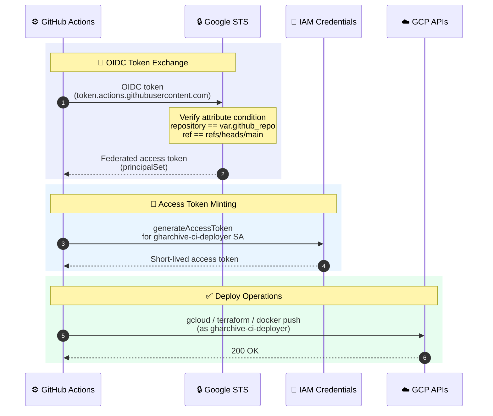

# terraform

**What this is:** the single Terraform root module that provisions *every* piece of GCP infrastructure this project depends on — no submodules, no workspaces. If a resource (bucket, dataset, table, Cloud Run Job, scheduler, service account, IAM binding, Artifact Registry repo, WIF pool / provider) exists in our GCP project, it was created here.

**What you get out of an `apply`:** a Cloud Scheduler → Cloud Run Job → GCS → BigQuery pipeline, plus a Workload Identity Federation setup that lets GitHub Actions deploy and run Terraform itself with no service-account keys anywhere.

**Where to start reading:** `locals.tf` (names + lifecycle constants), `iam.tf` (the three service accounts and what they can do), `wif.tf` (how GitHub Actions impersonates `gharchive-ci-deployer`).

> ↩ Back to [project overview](../README.md). For the workload that runs *inside* the Cloud Run Job, see [`ingest/README.md`](../ingest/README.md).

## Resource map

```mermaid
flowchart LR
    subgraph GH["🗂️ GitHub repo<br/><i>main / PRs</i>"]
        GHA["⚙️ GitHub Actions"]
    end

    subgraph WIF["🔒 Workload Identity Federation"]
        direction TB
        POOL["🏗️ github-pool"]
        PROV["🔍 github-provider<br/><i>OIDC, repo+ref pinned</i>"]
    end

    subgraph SAS["👥 Service Accounts"]
        direction TB
        CID["💼 gharchive-ci-deployer<br/><i>scoped: run/scheduler/AR + tfstate/runner/BQ</i>"]
        RUN["🤖 gharchive-runner<br/><i>storage.objectCreator</i>"]
        INV["🤖 gharchive-invoker<br/><i>run.invoker</i>"]
    end

    subgraph INFRA["☁️ GCP Resources"]
        direction TB
        AR["📦 Artifact Registry<br/><i>gharchive (Docker)</i>"]
        SCH["📅 Cloud Scheduler<br/><i>gharchive</i>"]
        JOB["⚡ Cloud Run Job<br/><i>gharchive</i>"]
    end

    subgraph DATA["📊 Data Layer"]
        direction TB
        GCS["🗄️ GCS bucket<br/><i>{project}-gharchive</i>"]
        BQDS[("📊 BigQuery dataset<br/><i>raw__gharchive</i>")]
        BQT["✅ External table<br/><i>ext__events</i>"]
    end

    GHA --> POOL --> PROV
    PROV -->|"impersonates"| CID
    CID -->|"manages"| AR
    CID -->|"manages"| SCH
    CID -->|"manages"| JOB
    CID -->|"manages"| GCS
    CID -->|"manages"| BQDS
    CID -.->|"impersonates (deploy)"| RUN

    SCH -->|"POST :run as"| INV
    INV --> JOB
    JOB -->|"runs as"| RUN
    JOB -->|"writes Parquet"| GCS
    GCS --> BQT
    BQT --> BQDS

    classDef primary   fill:#667eea,stroke:#764ba2,color:#fff,stroke-width:3px
    classDef secondary fill:#4facfe,stroke:#00f2fe,color:#fff,stroke-width:2px
    classDef accent    fill:#f093fb,stroke:#f5576c,color:#fff,stroke-width:2px
    classDef alert     fill:#f5576c,stroke:#c0392b,color:#fff,stroke-width:3px
    classDef success   fill:#38ef7d,stroke:#11998e,color:#1e293b,stroke-width:3px
    classDef warning   fill:#fef3c7,stroke:#f59e0b,color:#78350f,stroke-width:2px
    classDef neutral   fill:#f8fafc,stroke:#cbd5e1,color:#1e293b,stroke-width:1px

    class JOB,SCH primary
    class GCS,RUN,INV secondary
    class CID alert
    class POOL,PROV warning
    class AR warning
    class BQT,BQDS success
    class GHA neutral

    style GH fill:#94a3b815,stroke:#94a3b8,stroke-width:2px
    style WIF fill:#f5576c15,stroke:#f5576c,stroke-width:2px
    style SAS fill:#f093fb15,stroke:#f093fb,stroke-width:2px
    style INFRA fill:#667eea15,stroke:#667eea,stroke-width:2px
    style DATA fill:#38ef7d15,stroke:#38ef7d,stroke-width:2px
```



## What gets created, file by file

| File | Resources |
|---|---|
| `apis.tf` | Enables `cloudresourcemanager`, `iam`, `iamcredentials`, `sts`, `artifactregistry`, `run`, `cloudscheduler`, `storage`, `bigquery`. `disable_on_destroy = false` so `terraform destroy` doesn't turn off APIs other systems may rely on. |
| `gcs.tf` | Raw bucket `{project}-gharchive` — UBLA, public-access-prevention enforced, 7-day soft-delete window, and a lifecycle that promotes objects Standard → Nearline (30d) → Coldline (90d) → delete (180d). |
| `bigquery.tf` | Dataset `raw__gharchive` and external table `ext__events` over `gs://{bucket}/events/*.parquet` with `hive_partitioning_options.mode = "AUTO"` (which auto-discovers the `dt=YYYY-MM-DD/hr=HH/` partition keys from the path) and `autodetect = true`. `deletion_protection = true`. Note: at least one Parquet file must exist under the prefix before the table is created — `autodetect` reads it to infer the schema. |
| `artifact_registry.tf` | Docker repo `gharchive` with two cleanup policies — keep the 10 most-recent versions, delete untagged images older than 24 h. |
| `cloud_run_job.tf` | Job `gharchive` running as the `gharchive-runner` SA, env vars `GCS_RAW_BUCKET` / `LAG_HOURS` / `CATCHUP_HOURS`, CPU/memory/timeout from variables, `max_retries = 1`. Uses Google's placeholder `cloudrun/container/job` image at bootstrap; `lifecycle.ignore_changes = [containers[0].image]` so the CI image tag updates don't get reverted on `terraform apply`. |
| `cloud_scheduler.tf` | Cron job that POSTs to the Job's `:run` admin endpoint as the `gharchive-invoker` SA. Retry policy: `retry_count = 0`, min/max backoff 30s/300s — intentional (see *Operational notes*). |
| `iam.tf` | The three service accounts above. `gharchive-ci-deployer` gets the project-scoped roles CI needs to *update* infra (`run.developer`, `cloudscheduler.admin`, `artifactregistry.admin`) **plus `roles/viewer`** — viewer is required because `terraform plan` refreshes state of *every* managed resource (SAs, WIF pool/provider, BigQuery dataset, etc.) and refresh needs read access even on things CI can't modify. Project-level write IAM (serviceusage, IAM admin, WIF admin) is intentionally absent — those bootstrap changes are applied locally with owner-level creds. Plus: dataset-scoped `bigquery.dataOwner` + project-scoped `bigquery.jobUser`; bucket-scoped `roles/storage.admin` on **both the tfstate and gharchive buckets** (admin is needed because Terraform refresh of `google_storage_bucket_iam_member` resources calls `storage.buckets.getIamPolicy`, which is *not* in `roles/viewer` or `storage.objectAdmin`); `iam.serviceAccountUser` on `gharchive-runner` so CI can deploy on its behalf. `gharchive-runner` gets bucket-scoped `storage.objectCreator` **and `storage.objectViewer`** on the raw bucket — the viewer role is required because `gcs_writer.is_existing()` calls `blob.exists()` (which needs `storage.objects.get`) to honour the `_SUCCESS` idempotency contract; `objectCreator` alone is insufficient and causes the Cloud Run Job container to 403 on every hour. The two roles together still grant no delete capability. |
| `wif.tf` | Pool `github-pool` + OIDC provider `github-provider`. Attribute mapping (`google.subject`, `attribute.repository`, `attribute.ref`, `attribute.actor`) and an **attribute condition** that hard-locks the provider to this repo on `main` only — PR branches cannot mint a token, so `gharchive-ci-deployer` is unreachable from any PR workflow. |
| `main.tf` | Provider pin (`google ~> 5.40`), `terraform >= 1.6.0`, GCS backend (`bucket` & `prefix` passed at `init` time). |
| `locals.tf` | Every magic string lives here — bucket / SA / job / dataset names, lifecycle rule values, IAM role lists, common labels. |
| `variables.tf` / `outputs.tf` | Inputs / outputs (see tables below). |

## Identity flow (how a deploy authenticates)



At runtime (independent of CI):

- **Cloud Scheduler** authenticates to the Cloud Run Job admin API using an OAuth token minted for `gharchive-invoker`.
- **Cloud Run Job** runs the container with `gharchive-runner` as its identity, which has just enough scope to write objects to the raw bucket.

No service-account key files are issued or stored anywhere.

## Input variables (`variables.tf`)

Variables fall into two groups:

- **Required (3):** environment-specific values with no defaults — `project_id`, `region`, `github_repo`. These must be supplied via `terraform.tfvars` (local) or `TF_VAR_*` env vars (CI — set automatically by the workflow, see *CI/CD wiring*).
- **Operational defaults (8):** sensible defaults baked into `variables.tf`. Override in `terraform.tfvars` only if you need to tune.

| Name | Type | Default | Notes |
|---|---|---|---|
| `project_id` | string | *(required)* | Target GCP project. |
| `region` | string | *(required)* | Region for all regional resources; GCS bucket co-located. |
| `github_repo` | string | *(required)* | Pinned in the WIF attribute condition. In CI, auto-populated from `${{ github.repository }}`. |
| `lag_hours` | number | `1` | Passed to the Job as `LAG_HOURS`. Validator: `>= 0`. |
| `catchup_hours` | number | `3` | Passed to the Job as `CATCHUP_HOURS`. Validator: `>= 0`. |
| `schedule_cron` | string | `"30 * * * *"` | 5-field cron (validated by regex). Job timezone is `Etc/UTC`. |
| `scheduler_retry_count` | number | `0` | See *Operational notes*. Validator: `>= 0`. |
| `cloud_run_job_max_retries` | number | `1` | See *Operational notes*. Validator: `>= 0`. |
| `cloud_run_job_timeout` | string | `"900s"` | Per-task wall-clock cap. |
| `cloud_run_job_cpu` | string | `"1"` | vCPU per task. |
| `cloud_run_job_memory` | string | `"1Gi"` | Memory per task. |

For local runs, copy `terraform.tfvars.example` → `terraform.tfvars` and fill in at least the three required values. `terraform.tfvars` is gitignored by design (CI gets the same values via `TF_VAR_*` from GitHub secrets, not from a committed file).

## Outputs → GitHub secrets (`outputs.tf`)

After `terraform apply`, copy these four outputs into the repo's Actions secrets — they're the only thing the workflows need.

| Terraform output | GitHub secret | Used by |
|---|---|---|
| `project_id` | `GCP_PROJECT_ID` | both workflows |
| `region` | `GCP_REGION` | both workflows |
| `ci_deployer_sa_email` | `GCP_SA_EMAIL` | `google-github-actions/auth` (the SA to impersonate) |
| `wif_provider_id` | `GCP_WIF_PROVIDER` | `google-github-actions/auth` (the provider resource path) |

Other outputs (`gharchive_bucket_name`, `artifact_repo_id`, `cloud_run_job_name`, `runner_sa_email`, `bq_dataset`) are informational — handy for `gcloud` one-liners and `bq` queries.

## Bootstrap → first apply (one-time)

The Terraform state bucket can't be managed by the Terraform that *lives in* it. `bootstrap.sh` handles that chicken-and-egg:

```bash
cd terraform
PROJECT_ID=my-gharchive-prod REGION=asia-northeast3 ./bootstrap.sh
```

The script creates the state bucket with versioning, UBLA, public-access-prevention, and a noncurrent-version lifecycle (keep recent versions ≤ 10, delete others older than 90 days). It's idempotent — safe to re-run.

> **Bucket name must match `local.tfstate_bucket_name`** (`${PROJECT_ID}-gharchive-tfstate`). `iam.tf` grants `gharchive-ci-deployer` `roles/storage.admin` on exactly that name — if the bucket lives anywhere else, CI applies fail at backend lock time.

Then:

```bash
terraform init \
  -backend-config="bucket=${PROJECT_ID}-gharchive-tfstate" \
  -backend-config="prefix=terraform/state"

cp terraform.tfvars.example terraform.tfvars
$EDITOR terraform.tfvars

terraform plan
terraform apply        # first apply runs locally with your owner-level creds
```

After the first apply:

1. Copy the four outputs above into GitHub repo secrets.
2. Push to `main` → `ingest-deploy.yml` builds the first real image and points the Job at it (replacing the bootstrap placeholder).
3. From here on, all infra changes go through `terraform.yml` (plan + apply on push to `main`). Run `terraform plan` locally before merging — the workflow does not post plans to PRs (PR branches cannot authenticate to WIF by design).

**Known first-apply gotchas:**

- **IAM propagation races.** When the API is freshly enabled, dependent resources occasionally hit `Error 403: Permission denied` on the first apply. Re-running `terraform apply` is the fix — Terraform is idempotent and picks up where it left off.
- **BigQuery external table needs a seed file.** `google_bigquery_table.gharchive_events` uses `autodetect = true` to infer schema from existing Parquet, so the first apply will fail with `Failed to expand table … matched no files` if the bucket is empty. Run a one-hour local ingest (`cd ingest && python -m gharchive` with `GCS_RAW_BUCKET=<bucket>` and `TARGET_HOUR=<YYYY-MM-DD-H>`) to drop one Parquet file under `gs://{bucket}/events/dt=…/hr=…/`, then re-run `terraform apply`. After the first scheduled Job run lands new data, this never happens again.
- **Race between `google_bigquery_table` and `google_bigquery_dataset`, or between WIF pool and provider.** Both pairs use string-literal IDs (`local.bq_dataset_id`, `local.wif_pool_id`) instead of resource references, so Terraform's implicit dependency graph misses the edge. First apply may fail with a 404 on the dependent resource — re-running apply resolves it.

## CI/CD wiring

- **`.github/workflows/terraform.yml`** — runs on push to `main` for `terraform/**`. Authenticates via WIF, pins `terraform_version: 1.9.5` via `hashicorp/setup-terraform`, then runs `fmt -check -recursive` + `init` + `validate` + `plan` + `apply` of the saved `tfplan`. Required variables are supplied via `TF_VAR_*` env vars at the job level: `TF_VAR_project_id` and `TF_VAR_region` from GitHub secrets, `TF_VAR_github_repo` from the built-in `${{ github.repository }}` context (no separate secret). Operational-tuning variables fall back to defaults in `variables.tf`. PRs intentionally do not trigger this workflow — the WIF attribute condition only mints tokens for `refs/heads/main`, so run `terraform plan` locally before opening a PR. Concurrency group `terraform-${{ github.ref }}` with `cancel-in-progress: false` serialises applies against the GCS state lock.
- **`.github/workflows/ingest-deploy.yml`** — runs on push to `main` for `ingest/**`. Builds the image, pushes to Artifact Registry tagged with `${{ github.sha }}`, then `gcloud run jobs update gharchive --image=…` flips the Job to the new tag. Lifecycle ignore in `cloud_run_job.tf` is what makes this safe to do out-of-band from Terraform.
- **`.github/dependabot.yml`** keeps the Action versions current (weekly, max 5 open PRs).

## Operational notes

A few choices in here look conservative — they're deliberate:

- **`scheduler_retry_count = 0` + `cloud_run_job_max_retries = 1`.** The ingest container already retries every HTTP fetch up to 5× (`GharchiveClient._fetch_with_retry`) and re-attempts gap hours every run via `CATCHUP_HOURS`. Adding scheduler retries would risk a second invocation racing a still-running first one, and Cloud Run Job retries can't distinguish "really failed" from "gharchive hasn't published this hour yet". See [`ingest/README.md`](../ingest/README.md) for the retry semantics.
- **GCS lifecycle tiering (30d → Nearline, 90d → Coldline, 180d → delete).** Hot partitions stay on Standard for BigQuery query performance; older partitions get cheaper without breaking the external table (BigQuery reads all three classes transparently). 180-day retention is sized for portfolio/demo analytics — bump it via `gcs_delete_age_days` in `locals.tf` if you need a longer window.
- **Dataset-scoped `bigquery.dataOwner`, project-wide `bigquery.jobUser`.** `gharchive-ci-deployer` can do anything inside `raw__gharchive` but can't read or write any other dataset in the project.
- **WIF attribute condition pinned to `main` only.** PR branches cannot mint tokens — combined with the scoped `ci_deployer` roles (no project IAM/serviceusage/WIF admin), a malicious PR has no path to the GCP project. Trade-off: PR `terraform plan` comments aren't possible without a separate read-only SA; run plan locally instead.
- **External table, not native.** GCS is the source of truth; BigQuery just queries it. Reprocessing an hour is "delete the Parquet + `_SUCCESS`, rerun the Job" — no `MERGE`s, no partition swaps.
